# 📦 Pahana Edu Bookshop Online Billing System – Java EE Web Application

A comprehensive **web-based bookshop management system** built with **Java EE**, designed for "Pahana Edu" to efficiently manage customers, inventory, orders, and generate detailed reports.

---

## 📌 Overview
Pahana Edu Online Billing System is a **role-based Java EE web application** that manages customer records, inventory, billing, and reporting. It features **secure user authentication, role-based access control**, and robust reporting capabilities suitable for educational institutes or small businesses.

---

## 🚀 Core Functionality
- **User Authentication & Authorization** – Secure login/logout with role-based access for Admin, CoAdmin, and Staff.
- **Customer Management** – Add, update, search, and delete customer records with validation.
- **Bill Generation & Management** – Create bills, add items, calculate totals, track payment status, and manage bill records.
- **Item Management** – Add, update, view, and delete items with duplicate detection and data integrity checks.
- **Reports** – Daily & monthly sales, payment trends, bill status distribution, account summaries, overpayment analysis, top customers, most-sold items, and low/out-of-stock items (print/export supported).
- **Profile Management** – View and edit user profiles, change passwords, and validate profile data.
- **Search & Filter** – Search customers and bills by account number, name, phone, email, or date range.
- **Data Validation** – Ensure correct formats for emails, phone numbers, prices, and quantities.
- **Performance & Reliability** – Optimized database queries and tested for stability under load.
- **Security** – Password encryption, secure session handling, and prevention of unauthorized access.

---

## 🛠️ Technology Stack & Versions

| Component | Version |
|-----------|---------|
| Java | 24 |
| Java EE (Servlets, JSP) | 4.0.1 (Servlet API) |
| MySQL | 8.0+ |
| JDBC | MySQL Connector/J 8.4.0 |
| JavaMail API | 1.6.2 |
| Maven | 3.8.5+ |
| JUnit | 5.11.0 (Jupiter) |
| Maven WAR Plugin | 3.4.0 |

Frontend: HTML5, CSS3, JSP  
Build Tool: Maven  
Database: MySQL 8.0+

---

## 📋 Prerequisites

- Java 24 or higher
- Apache Tomcat 9.0 or higher
- MySQL 8.0 or higher
- Maven 3.8+

---

Here’s your **Installation & Setup** section properly formatted in Markdown with clear spacing, separators, and code blocks for readability:

````markdown
## 🔧 Installation & Setup
---

### 1️⃣ Clone the Repository
```bash
git clone https://github.com/dinithi-sasanka/dinithi_pahana_edu.git
cd dinithi_pahana_edu
````

---

### 2️⃣ Database Setup

**Create Database**

```sql
CREATE DATABASE pahana_edu;
```

**Run SQL Scripts**
Locate and execute the SQL script from:

```
dinithi_pahana_edu/src/main/resources/database/
```

**Tables Created:**

* bill\_items
* bills
* customers
* items
* stock
* users

---

### 3️⃣ Configure Database Connection

**Option A – Edit in `DBConnection.java`**
File Location:

```
src/main/java/com/example/dinithi_pahana_edu/dao/DBConnection.java
```

Update with your credentials:

```java
private String url = "jdbc:mysql://localhost:3306/pahana_edu";
private String username = "root";        // 🔑 Replace with your DB username
private String password = "dinithi2005"; // 🔑 Replace with your DB password
```

**Option B – (Recommended) Use `application.properties`**
File Location:

```
src/main/resources/application.properties
```

Example configuration:

```properties
spring.datasource.url=jdbc:mysql://localhost:3306/pahana_edu
spring.datasource.username=root
spring.datasource.password=dinithi2005
```

> Then update `DBConnection.java` to read from this properties file. This approach is cleaner and more secure.

---

### 4️⃣ Build the Project

**Using Maven wrapper (recommended):**

```bash
./mvnw clean package
```

**Or using system Maven:**

```bash
mvn clean package
```

---

### 5️⃣ Deploy to Tomcat

* Copy the generated `.war` file from:

```
target/dinithi_pahana_edu.war
```

* Paste into Tomcat’s **webapps** directory.
* Start the Tomcat server.
* Access the application at:
  👉 [http://localhost:8081/dinithi\_pahana\_edu](http://localhost:8081/dinithi_pahana_edu)

---

### 6️⃣ Default User Credentials (for Testing)

| Role     | Username | Password |
| -------- | -------- | -------- |
| Admin    | admin    | admin123 |
| Co-Admin | coadmin  | co123    |
| Staff    | staff    | staff123 |

---

### 7️⃣ Troubleshooting

* If MySQL is not running → Start MySQL service
* If port 8081 is busy → Update `server.xml` in Tomcat to a free port
* Ensure `pom.xml` dependencies are installed correctly

---

``
## 🗂️ Project Structure

```markdown
📁 dinithi_pahana_edu
├── src/
│   ├── main/
│   │   ├── java/
│   │   │   └── com/example/dinithi_pahana_edu/
│   │   │       ├── dao/        # DB connections
│   │   │       ├── model/      # Entity classes
│   │   │       ├── service/    # Business logic
│   │   │       └── servlet/    # Servlet controllers
│   │   ├── resources/          # Config & SQL scripts
│   │   │   ├── database/       # SQL scripts
│   │   │   └── application.properties
│   │   └── webapp/
│   │       ├── WEB-INF/web.xml
│   │       └── JSP files       # All JSP pages
├── test/
│   └── java/
│       └── com/example/dinithi_pahana_edu/
│           ├── authentication/       # LoginUsersTest.java
│           ├── usermanagement/       # UserManagementTest.java
│           ├── customer/             # CustomerManagementTest.java, CustomerSearchTest.java, CustomerEditTest.java
│           ├── bill/                 # BillManagementTest.java, BillCalculationTest.java
│           ├── item/                 # ItemManagementTest.java
│           ├── profile/              # ProfileManagementTest.java
│           ├── account/              # CustomerAccountViewTest.java, AccountReportingTest.java
│           ├── reports/              # DailySalesReportTest.java, LowStockItemsReportTest.java, MonthlySalesReportTest.java, MostSoldItemsReportTest.java, TopCustomersReportTest.java
│           └── dao/                  # BillDAOTest.java, CustomerDAOTest.java, ItemDAOTest.java, UserDAOTest.java
├── target/                              # Compiled output
├── .gitignore
├── README.md
├── REPORTS_TESTING_SUMMARY.md
├── JUNIT_TESTING_GUIDE.md
├── EMAIL_SETUP_GUIDE.md
├── mvnw
├── mvnw.cmd
└── pom.xml
```
## 📊 Features Overview
---

## 🔐 Login & Role-Based Dashboards

When a user logs in, the system first **verifies their credentials** and determines their role: **Admin**, **Co-Admin**, or **Staff**. After successful login, the user is redirected to the corresponding **role-specific dashboard**:

> ✅ **Note:** Upon login, users are automatically directed to their **role-specific dashboard**, ensuring they only see and access features permitted for their role.
> 
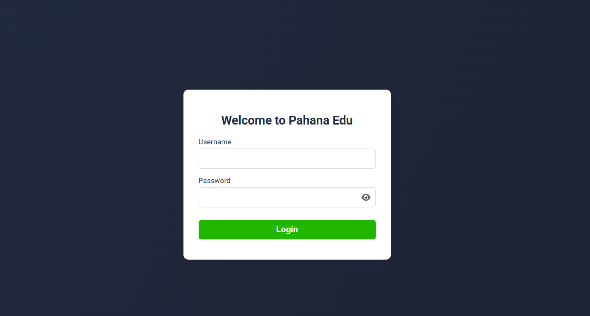
1. **Admin Dashboard**

    * Provides full access to all features, including user role management, item management (Add/Update/Delete), bill management (Edit/Delete/View), report generation, customer management, profile management, and system settings.
    * Admins can add or remove users, manage roles, and oversee all business operations.
   
   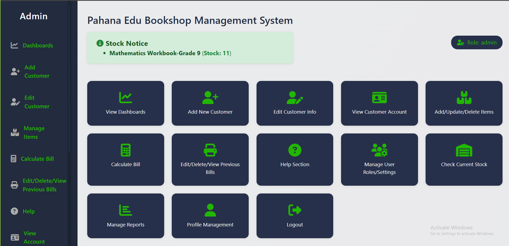
---

2. **Co-Admin Dashboard**

    * Provides most features available to Admins but with limited permissions: cannot manage user roles.
    * Can manage items, bills, customers, reports (if allowed), profile, and check stock.
    * Ideal for day-to-day operational control without full administrative privileges.
   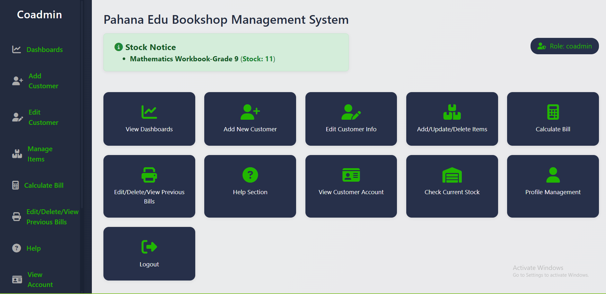
---


3. **Staff Dashboard**

    * Provides access to core operational features: view items, search items, view customer accounts, create bills, check stock, and manage their own profile.
    * Staff cannot add or delete items, generate restricted reports, or manage users.
    * Focused on supporting daily sales and customer service tasks.
   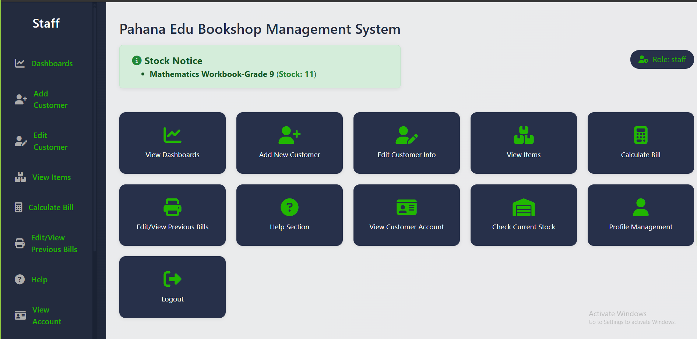

---


### 📈 View Dashboards
See sales analytics, trends, and system overviews.  
**How:** Click the **"View Dashboards"** **card** on the main dashboard.  
**When to use:** To get a quick overview of sales, customer activity, or inventory trends.  
**Tip:** Check this before making business decisions or planning stock orders.  
**Example:** At month-end, click the dashboard card to see which items sold best.


### ➕ Add New Customer
Register new customers in the system.  
**How:** Click the **"Add New Customer"** **card** or **menu button**, fill in the details, and click **Save**.

**Additional Feature:** After adding, you can manage all customers by clicking the **"View Customers"** **button**.
- On the **View Customers** page, you can **search** for customers by name, account number, or other details.
- You can also **delete** a customer from the list by clicking the **Delete** button next to their record.

**When to use:**
- Add a customer when they visit for the first time or want to make a purchase on account.
- View, search, or delete customers to manage customer records efficiently.

**Tip:**
- Always double-check the customer's contact details before saving.
- Use the search feature to quickly find a customer before editing or deleting.

**Example:**
- A parent comes to buy books for their child and is not yet in the system. Use **Add New Customer** first.
- Later, click **View Customers** to verify the record or remove a duplicate entry.
> ✅ **Note:** This feature is accessible to **all roles**: Admin, Co-Admin, and Staff, ensuring everyone can manage customer records according to their permissions.

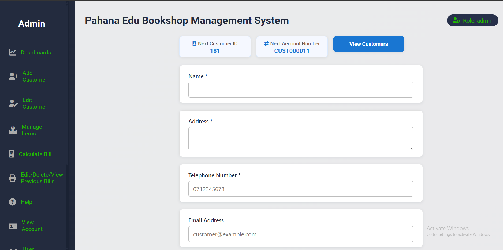
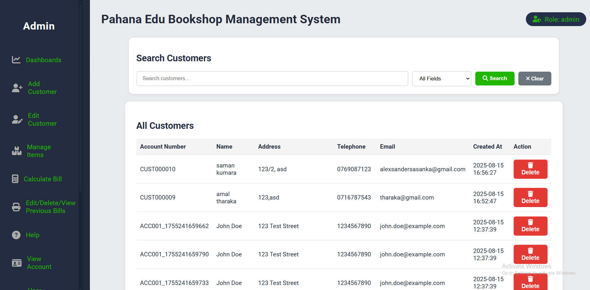

### ✏️ Edit Customer Info
Update existing customer information.  
**How:** Click the **"Edit Customer Info"** **card** or **side menu item**, search for the customer, edit the details, and click **Save**.  
**When to use:** If a customer updates their phone number, address, or other details.  
**Tip:** Use the search field to quickly locate the customer.  
**Example:** A customer calls to update their email for notifications.
> ✅ **Note:** This feature is accessible to **all roles**: Admin, Co-Admin, and Staff.
> 
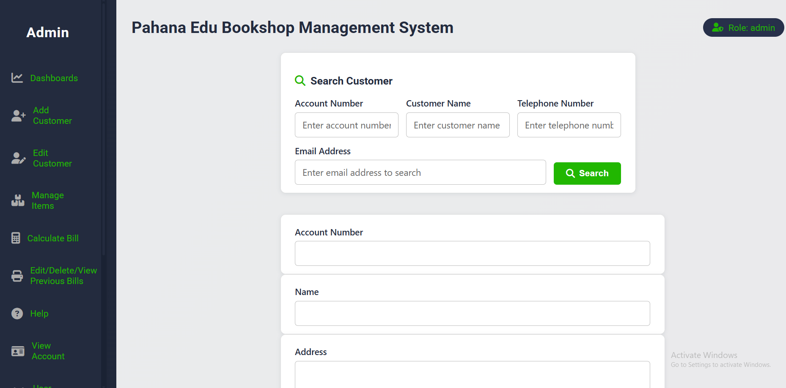
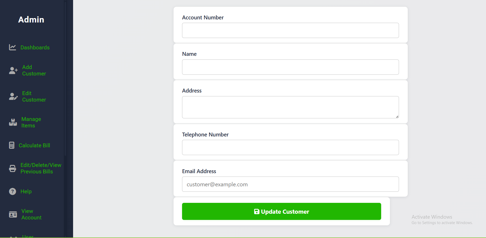

### 🧾 View Customer Account
See account details and purchase history.  
**How:** Click the **"View Customer Account"** **card** or **menu button**, search for the customer, and review their account.  
**When to use:** To check total purchases, outstanding balances, or purchase history.  
**Tip:** Helps manage customer relationships and financial records.  
**Example:** When a customer requests their account summary.
> ✅ **Note:** This feature is accessible to **all roles**: Admin, Co-Admin, and Staff.
>
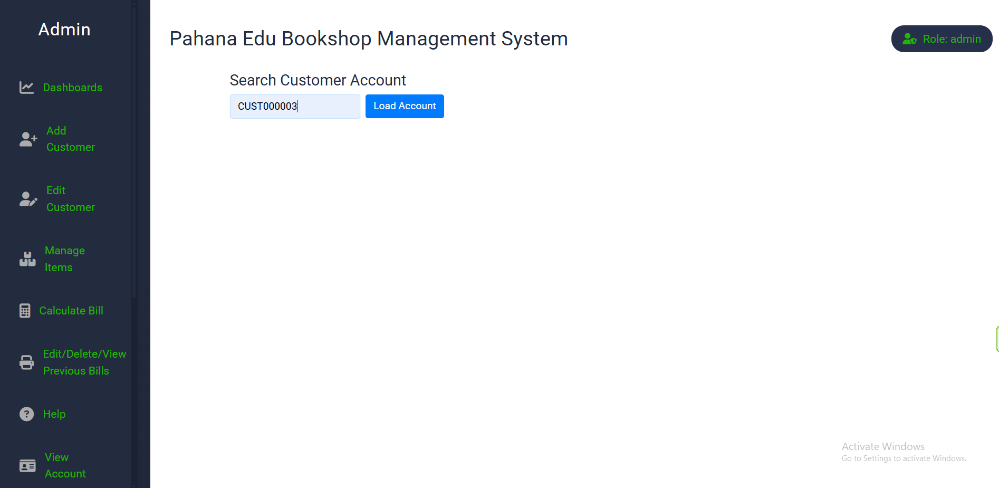
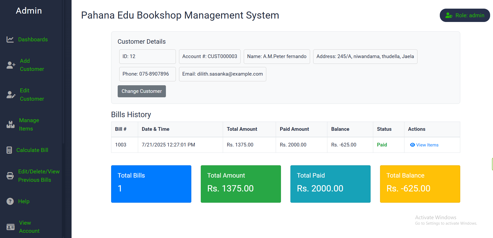

### 📦 Add/Update/Delete Items

Manage inventory items.

**How:**

* **Admin & Co-Admin:** Click the **"Add/Update/Delete Items"** **card** on the dashboard or **"Manage Items"** in the side menu, then choose the desired action: **Add**, **Update**, **Delete**, **View**, or **Search**.
* **Staff:** Click the **"View Items"** **card** on the dashboard or **"Manage Items"** in the side menu to **View** and **Search** items only.

**Role-Based Access:**

* **Admin & Co-Admin:** Can **Add**, **Update**, **Delete**, **View**, and **Search** items.
* **Staff:** Can only **View** and **Search** items.

**When to use:**

* Admin/Co-Admin: Add new inventory, update stock, remove discontinued items, or review item details.
* Staff: Check stock levels or search for item information.

**Tip:**

* Always verify stock quantity and item details before adding or updating.
* Use search filters to quickly locate items.

**Example:**

* A new shipment of books arrives. Admin/Co-Admin clicks the **"Add/Update/Delete Items"** card or side menu to add them to the inventory and can also search or view items.
* Staff can click the **"View Items"** card or side menu to view the inventory or search for a specific book.

---


> ✅ **Note:** This feature is accessible to **Admin and Co-Admin** for all actions: Add, Update, Delete, View, and Search.  
> ✅ **Note:** **Staff** can only **View** and **Search** items.
>
**Below are the views accessible to Admin and Co-Admin:**

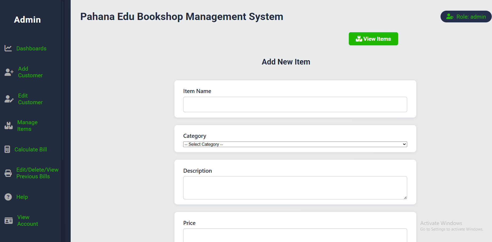
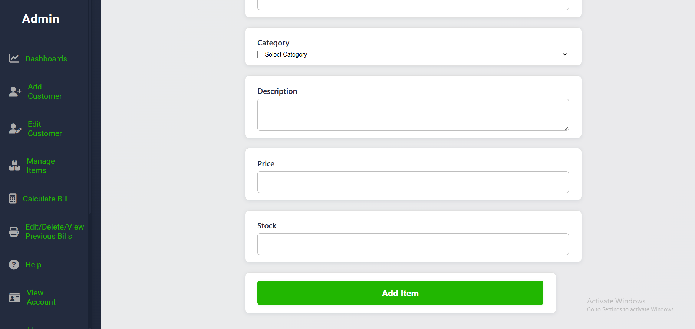
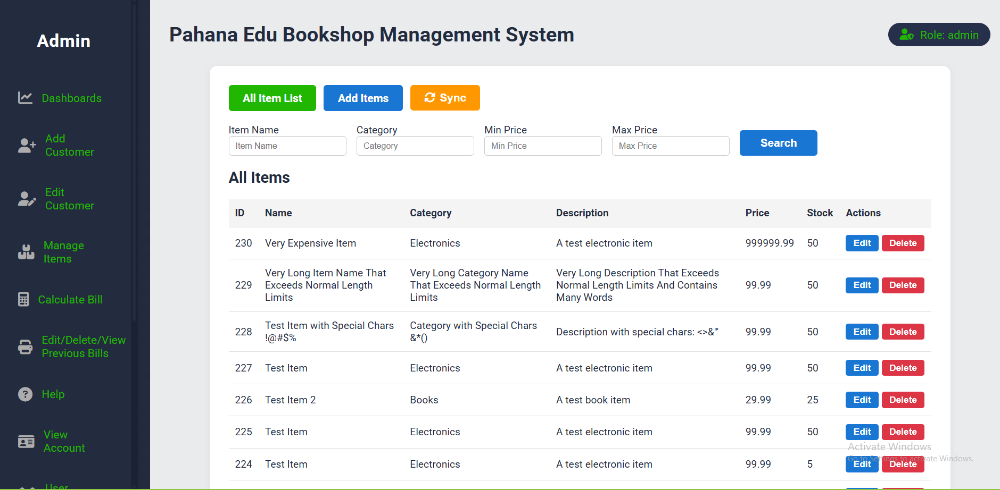

**Below are the views accessible to staff:**
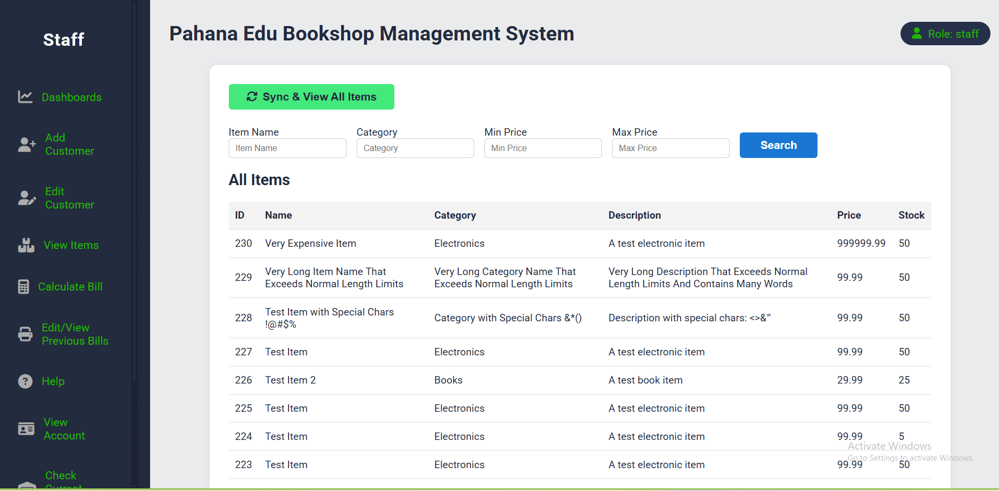

### 🧮 Calculate Bill
Generate bills for customer purchases.  
**How:** Click the **"Calculate Bill"** **card** or **menu button**, select items, enter quantities, and click **Generate**.  
**When to use:** When a customer makes a purchase and you need a receipt or invoice.  
**Tip:** Double-check total amounts and item details before finalizing.  
**Example:** Customer buys 5 books—generate the receipt after payment.
> ✅ **Note:** This feature is accessible to **all roles**: Admin, Co-Admin, and Staff.
>

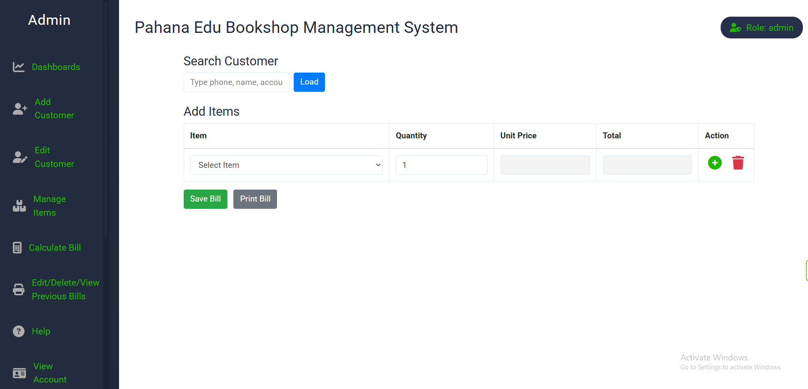


---

### 🖨️ Edit, Delete,Print and View Previous Bills

Access and manage previous bills.

**How:**

* **Admin & Co-Admin:** Click the **"Edit/Delete/View Previous Bill"** **card** on the dashboard or the  **side menu item**, then **View**, **Search**, **Edit**, **Print**, or **Delete** bills.
* **Staff:** Click the **"Edit/View Previous Bill"** **card** on the dashboard or the **side menu item**, then **View**, **Search**, **Edit**, and **Print** bills (cannot delete).


**When to use:**

* Check, edit, or print bills for customers. Admin/Co-Admin can also remove incorrect or duplicate bills.

**Tip:**

* Always verify the bill details before printing or editing.
* Use search filters to quickly locate bills.

**Example:**

* A customer requests a copy of a past bill: Staff can view, search, edit, and print it. Admin/Co-Admin can also delete a bill if needed.

---
> ✅ **Note:** * **Admin & Co-Admin:** Can **View**, **Search**, **Edit**, **Print**, and **Delete** bills.
> 
> ✅ **Note:* **Staff:** Can **View**, **Search**, **Edit**, and **Print** bills, but **cannot Delete**.
>
**Below are the views accessible to Admin and Co-Admin:**
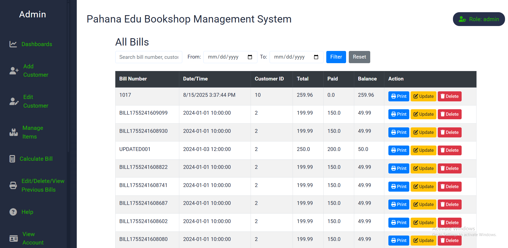

**Below are the views accessible to staff:**
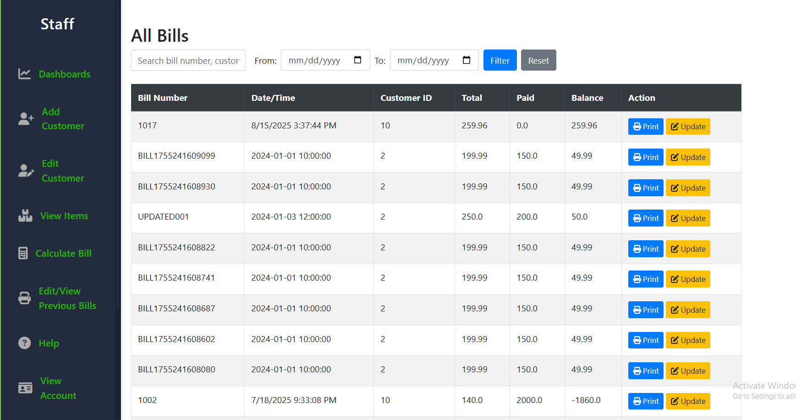


---

### 📊 Manage Reports

Generate and view business reports and analytics.

**How:** Click the **"Manage Reports"** **card** or **side menu item**, then select the desired report:

* **Top Customers Report**
* **Most Sold Items Report**
* **Daily Sales Report**
* **Monthly Sales Report**
* **Low Stock Items Report**

**When to use:** To analyze sales, customer behavior, and inventory status.

**Tip:** Run reports regularly to track performance and identify trends.

**Example:** At month-end, generate the Monthly Sales Report and Top Customers Report to plan next month’s stock and promotions.

---

> ✅ **Note:** This feature is accessible to **Admin users only**.


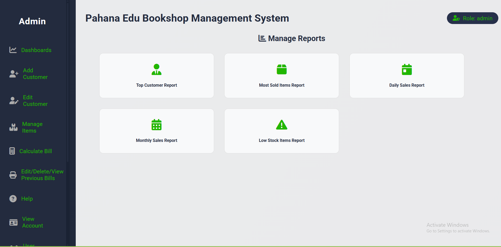
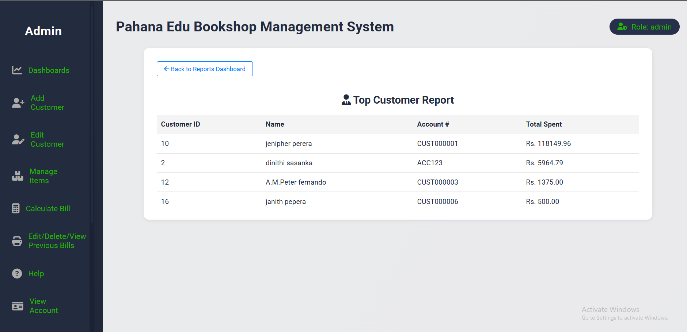
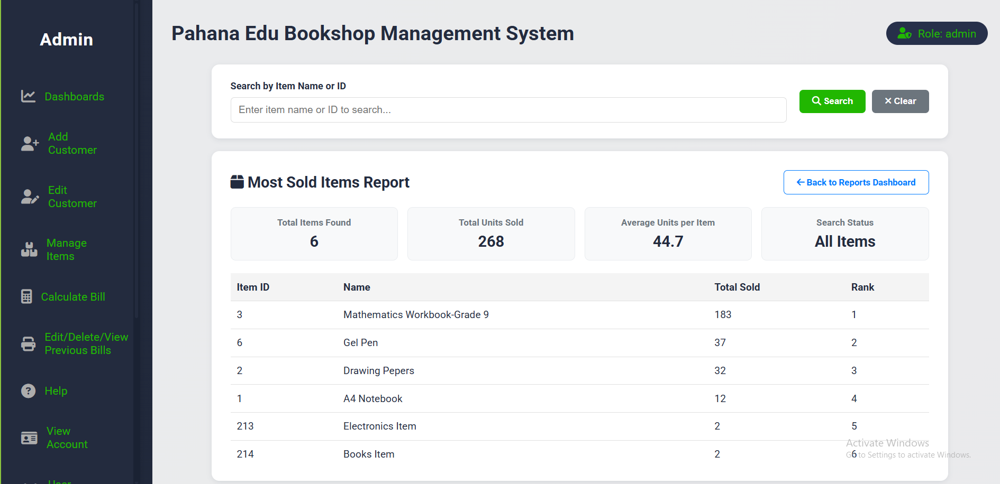
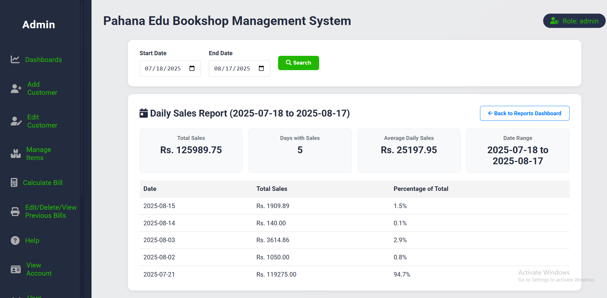
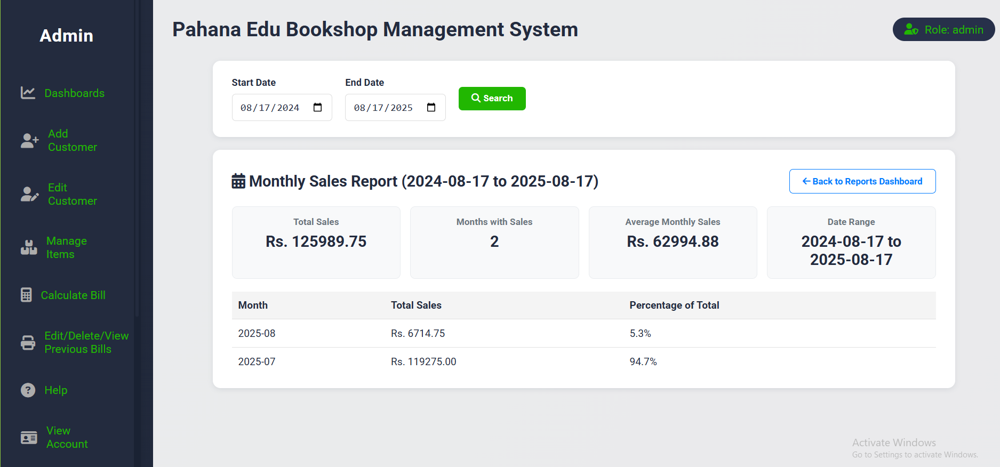
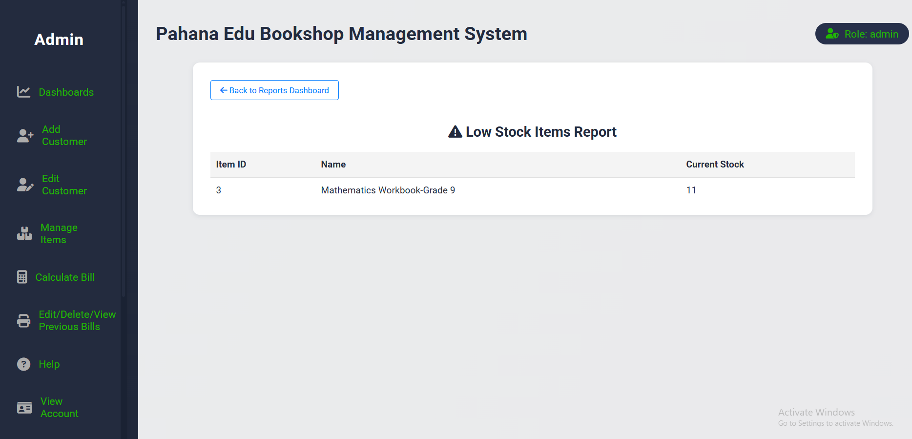


---

### 👥 User Role Management

Manage user accounts and system access permissions.

**How:** Click the **"User Role Management/Settings"** **card** or **side menu item**, then:

* **Add** new users
* **Edit** existing users
* **View** all users
* * **Search** users
* **Delete** users

**When to use:** To add new users to the system, assign roles, update user permissions, review all users, or remove users as needed.

**Tip:** Regularly review user access to maintain system security and ensure only authorized users have proper permissions.

**Example:** A new staff member joins. Admin can create their account, edit details of existing users, view all users, or delete users if necessary.

---
> ✅ **Note:** This feature is only for **Admin users**. Staff and Co-Admin do not have access.


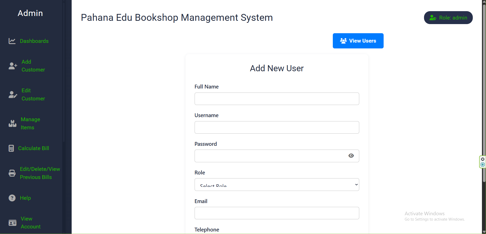
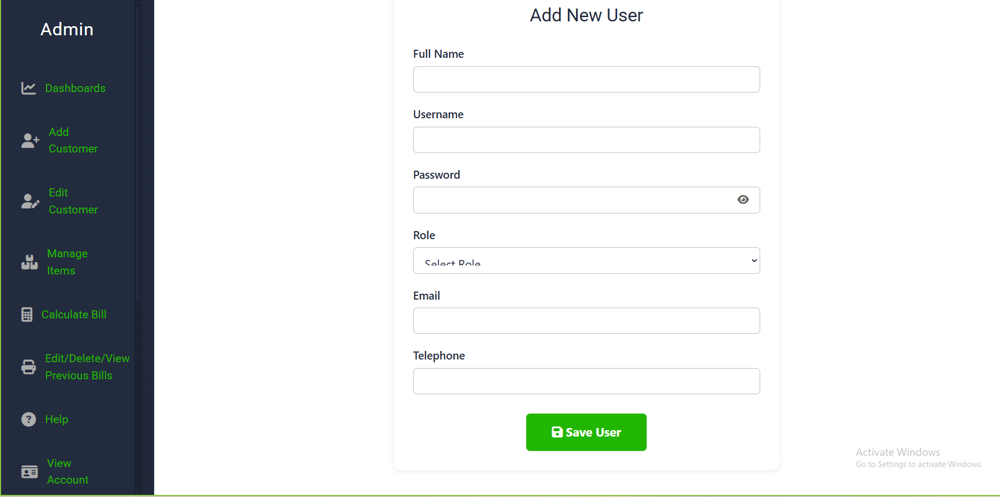
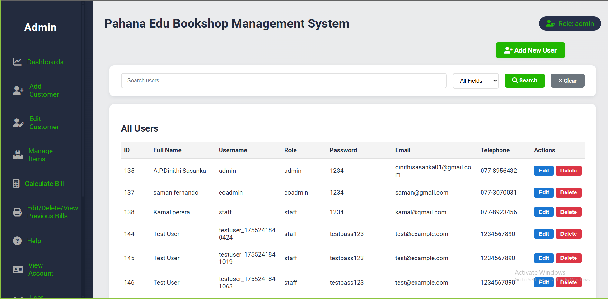

---

### 📊 Check Current Stock

View the current inventory levels of all items in the system.

**How:** Click the **"Check Current Stock"** **card** or **side menu item** to see a list of all items along with their quantities, categories, and stock status. You can also **search** for specific items.

**When to use:** To monitor inventory levels, verify stock availability, or check which items need replenishment.

**Tip:** Regularly check stock to prevent shortages and avoid overstocking. Use search filters to quickly locate items.

**Example:** Before a busy weekend, check current stock to ensure popular books or products are sufficiently available for sale.

---

> ✅ **Note:** This feature is accessible to **all roles**: Admin, Co-Admin, and Staff.
> 
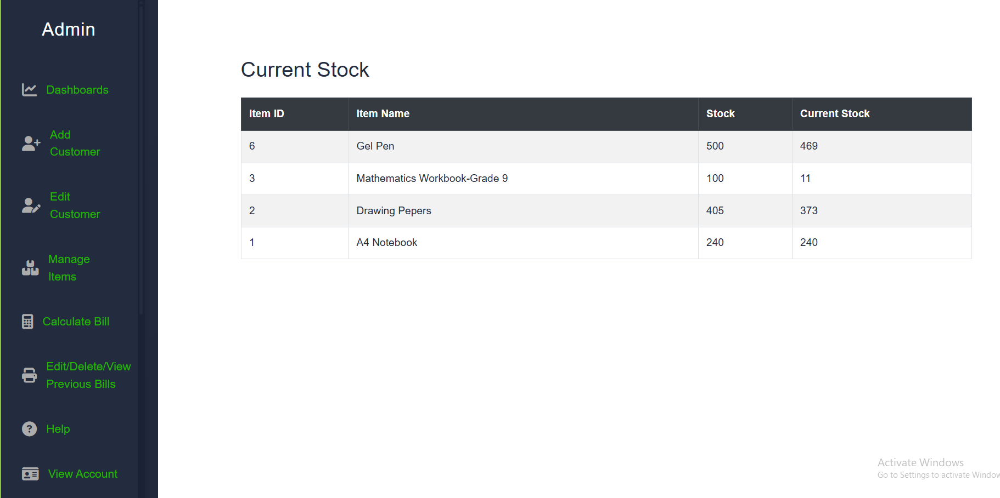

---

### 👤 Profile Management

Manage and update your personal profile information.

**How:** Click the **"Profile Management"** **card** or **side menu item**, edit your details (name, email, phone, etc.), and click **Save** to update.

**When to use:** To update personal information, such as contact details, email, or password.

**Tip:** Keep your profile information up-to-date to ensure smooth communication and system notifications.

**Example:** If you change your phone number or email, use this feature to update your profile so that you continue receiving important system alerts and notifications.

---
> ✅ **Note:** This feature is accessible to **all roles**: Admin, Co-Admin, and Staff.

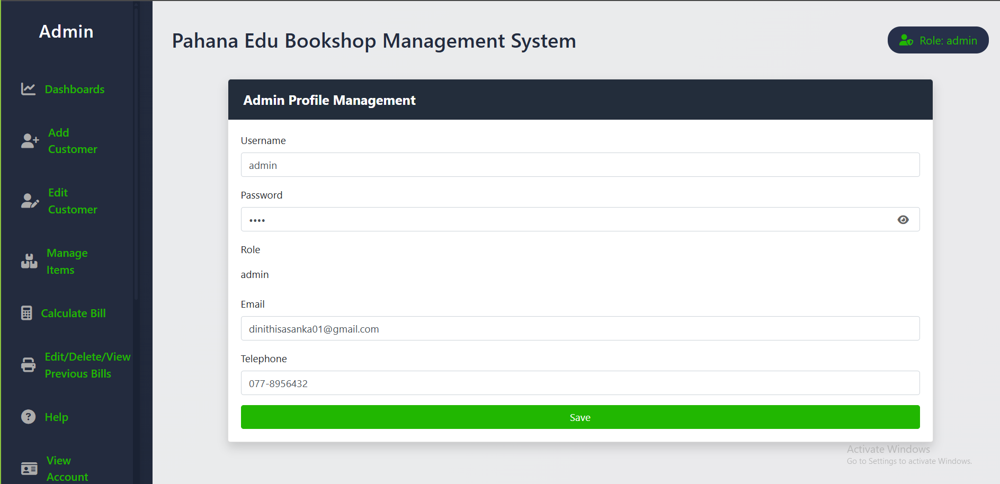

---

### 🔒 Log Out

Securely exit the system when you’re done.

**How:** Click the **"Log Out"** **card** or **side menu item**. This will end your session and return you to the login page.

**When to use:** Always log out when leaving the system to protect sensitive data and prevent unauthorized access.

**Tip:** Make it a habit to log out, especially when using shared or public computers.

**Example:** After finishing daily tasks or checking reports, click **Log Out** to securely exit the system.

---
> ✅ **Note:** This feature is accessible to **all roles**: Admin, Co-Admin, and Staff.


## 🧪 Running Tests via IDE
All functional testing is done using **JUnit**. The tests cover authentication, user management, customer management, bill management, item management, profile management, account management, report generation, and DAO operations.

### Running Tests

1. **Run all tests**
```bash
# Using Maven wrapper
./mvnw test

# Or using system Maven
mvn test
````

2. **Run a specific test class**

```bash
# Example: Run authentication tests
./mvnw test -Dtest=LoginUsersTest

# Example: Run customer management tests
./mvnw test -Dtest=CustomerManagementTest
```

3. **Run all DAO tests**

```bash
./mvnw test -Dtest=*DAOTest
```

> You can also run any individual test directly from your IDE by right-clicking the test file (e.g., `LoginUsersTest.java`, `BillManagementTest.java`) and selecting **Run**.


You can run the test classes directly from your IDE:

1. Open your IDE (IntelliJ IDEA).
2. Navigate to the test class you want to run. For example:
    - `LoginUsersTest.java`
    - `UserManagementTest.java`
    - `CustomerManagementTest.java`
    - `BillManagementTest.java`
    - `ItemManagementTest.java`
    - `ProfileManagementTest.java`
    - `CustomerAccountViewTest.java`
    - `AccountReportingTest.java`
    - `DailySalesReportTest.java`
    - `LowStockItemsReportTest.java`
    - `MonthlySalesReportTest.java`
    - `MostSoldItemsReportTest.java`
    - `TopCustomersReportTest.java`
    - `BillDAOTest.java`
    - `CustomerDAOTest.java`
    - `ItemDAOTest.java`
    - `UserDAOTest.java`
3. Right-click the file and select **Run As → JUnit Test** (Eclipse) or **Run → Run 'ClassNameTest'** (IntelliJ IDEA).
4. Check the results in the JUnit/Test window to see if all tests pass.


---

## 🎨 UI/UX Features

* Modern **Bootstrap 5** design
* **Responsive layout** for all devices
* **Interactive dashboard** with charts and summaries
* **Modal dialogs** for forms
* **Toast notifications** for user feedback
* **Loading indicators** for seamless operations
* **Search and filter functionality** for quick data access

---

## 👨‍💻 Author

**Dinithi Sasanka**

* **Email:** [dinithisasanka01@gmail.com](mailto:dinithisasanka01@gmail.com)
* **LinkedIn:** [https://www.linkedin.com/in/dinithi-sasanka-b88aa032a/](https://www.linkedin.com/in/dinithi-sasanka-b88aa032a/)
* **GitHub:** [https://github.com/dinithi-sasanka/](https://github.com/dinithi-sasanka/)

---

## 📞 Support

For support and questions:

* **Create an issue on GitHub**: [https://github.com/dinithi-sasanka/dinithi\_pahana\_edu/issues](https://github.com/dinithi-sasanka/dinithi_pahana_edu/issues)

---


`
